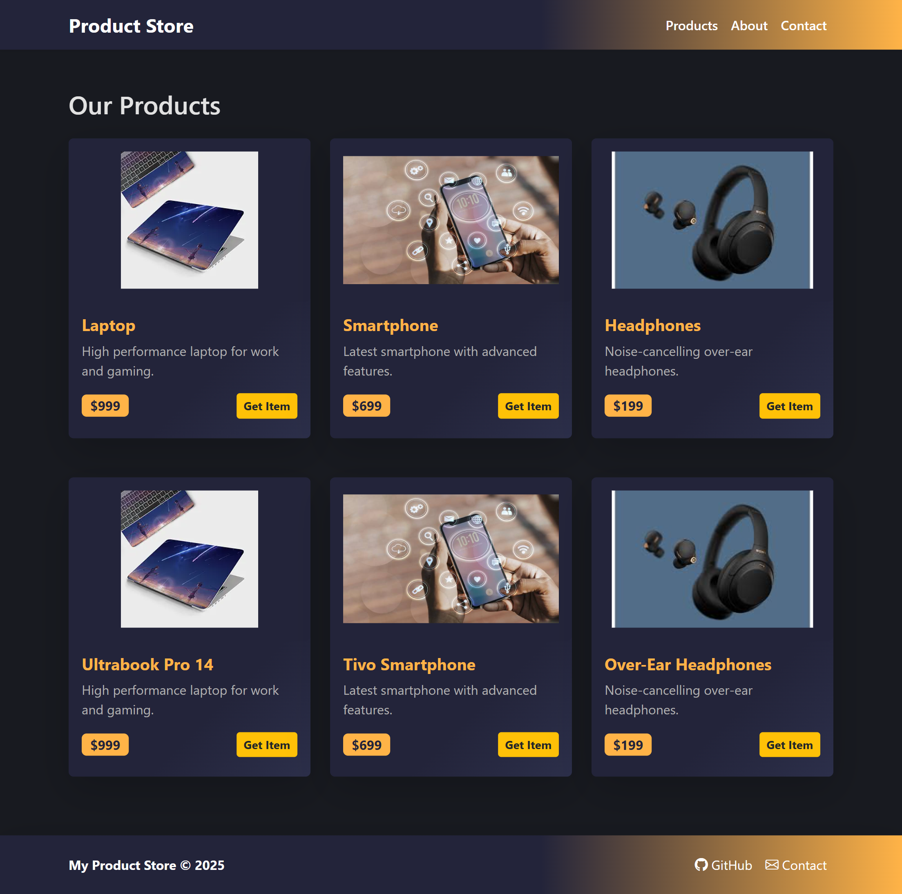

# Step of use Explorer

## Getting Started

1. **Install dependencies**
	```bash
	npm install
	```

2. **Start the development server**
	```bash
	npm run dev
	```

3. **Open in browser**
	Navigate to [http://localhost:5173](http://localhost:5173) (or the port shown in your terminal).

## Folder Structure

```
Explorer/
├── public/
│   └── vite.svg
├── src/
│   ├── assets/
│   ├── layout/
│   ├── pages/
│   ├── App.jsx
│   ├── main.jsx
│   └── index.css
├── index.html
├── package.json
├── vite.config.js
├── eslint.config.js
└── README.md
```

## Features & What I Learned

- React component structure & props
- Responsive UI with Bootstrap
- Asset management for images
- Clean code and modular design

## Deployment

You can deploy this project to platforms like Vercel or Netlify for a live demo.
 # screenshot 
